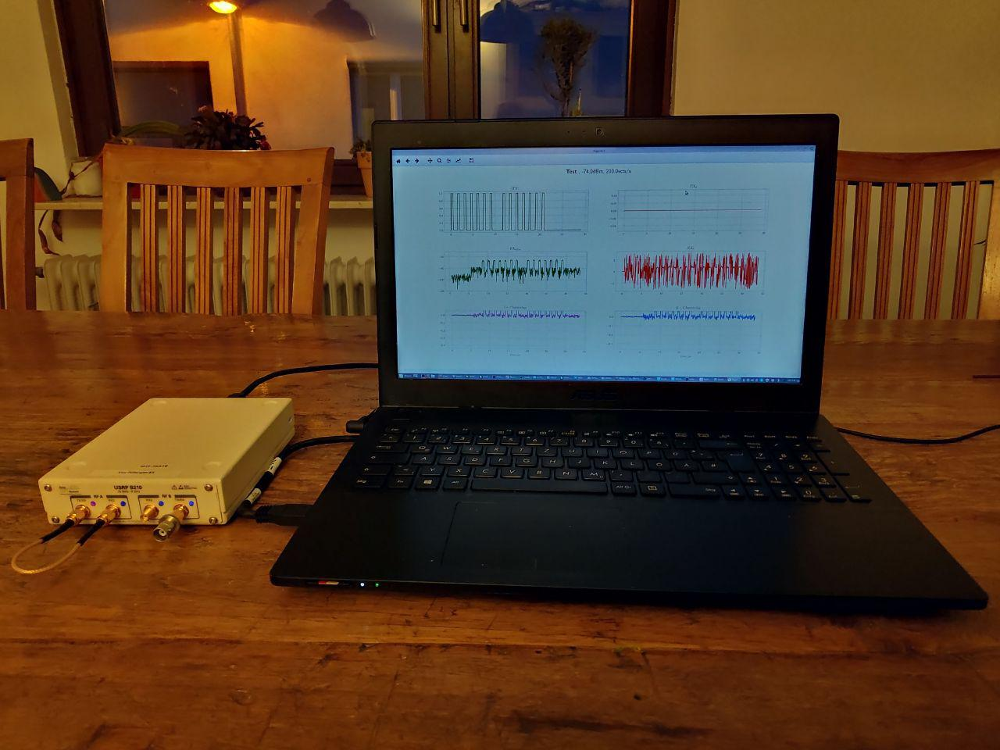

# ettus_moc_up


ETTUS B210 Moc up tool

# Warning:
```
NEVER send to high levels to the input of the SDR.
The Tx-Chain levels might destroy the Receiver of the SDR!
```

## Install:
The installation on Ubunutu is 95% automated:
 Download this repo and run `install.sh` and execute:
 ```
 sudo apt install git #Optional if git not jetzt installed
 git clone https://github.com/slevon/ettus_moc_up.git
 cd ettus_moc_up
 chmod +x install.sh
 sudo ./install.sh
 ```
 This should download everything you need and start compiling the ettus uhd lib
 with the recommended settings.
 If a s problem should arise you can view the install script to see the steps needed
 for the setup. (There might be some broken __cd__ commands ^^ )
 The install script does the following for you:
  * get the neccesary dependencies for compiling the ettus uhd
  * download the uhd source
  * compile the source
  * create a virtual python environment
  * install the uhd python lib and other tools into the venv
  * download the fpga images for the SDR
  * setup linux groups and udev rules for the sdr


# References

http://files.ettus.com/manual/page_install.html


## Windows

https://kb.ettus.com/Building_and_Installing_the_USRP_Open_Source_Toolchain_(UHD_and_GNU_Radio)_on_Windows


## Linux

https://kb.ettus.com/Building_and_Installing_the_USRP_Open-Source_Toolchain_(UHD_and_GNU_Radio)_on_Linux


If the Python3 Lib is not created an alternative cmake command could be:
```
cmake -DENABLE_PYTHON_API=ON -DENABLE_PYTHON3=ON -DENABLE_C_API=ON -DPYTHON_EXECUTABLE=/usr/bin/python3 -DPYTHON_LIBRARIES=/usr/lib/x86_64-linux-gnu/libpython3.6m.so ../
```


## Run:
Verfiy if you can connect to SDR using Python:
```
python3 ettus_find_devices.py
```

Than run the testtool
```
python3 testdata_generator.py
```

It will show two plots an create 3 Files: 2 png of the plots and
a `*.npy` File, that will contain the samples as numpy array.


This array can be read using python or a c++ lib:
https://github.com/llohse/libnpy

An example C++-Programm is in the tests dir of the project
